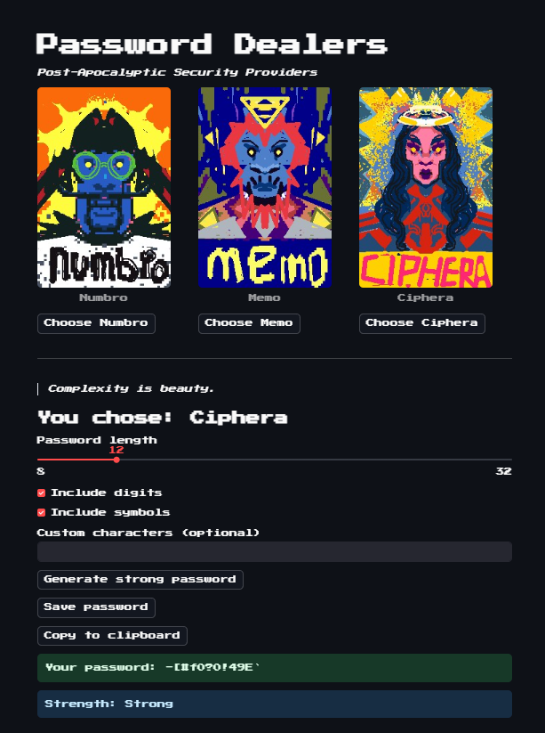

# 🔐 Password Dealers

A cyberpunk-themed password generator dashboard — built with **Streamlit** — where each password type is personified as a unique post-apocalyptic character.

This project started as part of a course section on **dashboard building with Streamlit**, but quickly evolved into something more personal.

---

## 🎭 Concept

Rather than sticking to a standard password generator, I designed three distinct characters, each representing a different generation strategy:

- **Numbro** → PIN-only dealer, precise and logical  
- **Memo** → Delivers memorable, word-based passwords with a poetic flavor  
- **Ciphera** → Stylish and chaotic, she builds complex passwords with symbols and entropy

Each dealer speaks in cryptic, motivational one-liners about the importance of strong passwords — creating a small narrative and immersive feel around an otherwise simple task.

---

## 📦 Features

- Interactive **Streamlit dashboard**
- Choose between three generation modes (PIN, Memorable, Complex)
- Customization options (length, separators, digits, symbols)
- Each character has their own **quote bank**
- Save password to file (`.txt`)
- Pixel art portraits drawn manually in **Aseprite**

---

## 💡 Why This Project?

This dashboard was part of the *dashboard building* unit in my learning journey.  
Instead of following it literally, I turned it into something **fun and personal** — to not only practice Streamlit features, but also to bring art, story, and function together.

It taught me:
- Layouts and columns
- `st.session_state` for UI state handling
- Custom fonts and minor HTML/CSS tweaks
- And most importantly: Streamlit can be more than just analytics.

---

## ⚠️ Known Limitation

Due to browser/Streamlit restrictions, the **copy-to-clipboard** button does not work in deployed versions.  
Although I implemented a workaround using custom HTML + JS, it interfered with layout aesthetics.  
So for now, I chose **visual clarity over functionality**.

---

## 🎨 Art Direction

Each dealer was hand-painted in **Aseprite** with a bold, gritty pixel-art style — influenced by dystopian UIs, retro graphics, and game menus.  
This project mixes **UI storytelling** with **utility**.

---

## 🛠 Tech Stack

- Python 3.11+
- Streamlit
- NLTK (for word list)
- Pyperclip (for local clipboard copy)
- Aseprite (for art)

---

## 📂 Folder Structure

```
project-1.4-password-dealers/
├── app.py
├── requirements.txt
├── README.md
├── .gitignore
├── assets/
│   └── ciphera_placeholder.png
│   └── memo_placeholder.png
│   └── numbro_placeholder.png
├── src/
│   ├── base.py
│   ├── constants.py
│   ├── memorable_generator.py
│   ├── pin_generator.py
│   ├── random_generator.py
│   ├── ui/
│   │   └── export_tools.py
│   ├── utils/
│   │   └── strength_estimator.py
│   │   └── uniqueness_tester.py
```

---

## 🧠 Final Note

This project was more than just a Streamlit exercise — it was a playground to mix code, design, and narrative.  
Even a password generator can tell a story if you let it.

> **Built with pixels, purpose, and a bit of chaos.**

## 📸 Screenshot

Here’s a quick look at the app:



## 👤 Author

**Hossein Mehrabi**  

- GitHub: [@meowsawknee](https://github.com/meowsawknee)  
- Made with 💻, 🎨, and more than a few `Ctrl+Z`s
